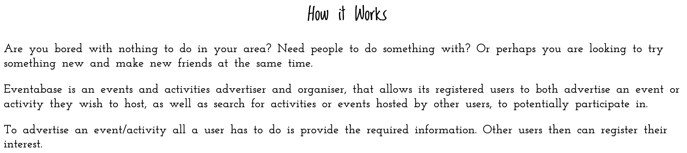
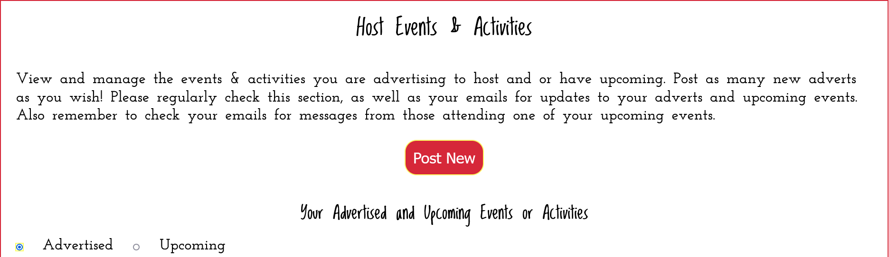
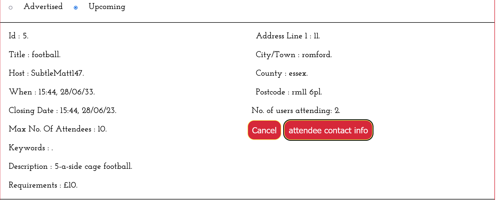
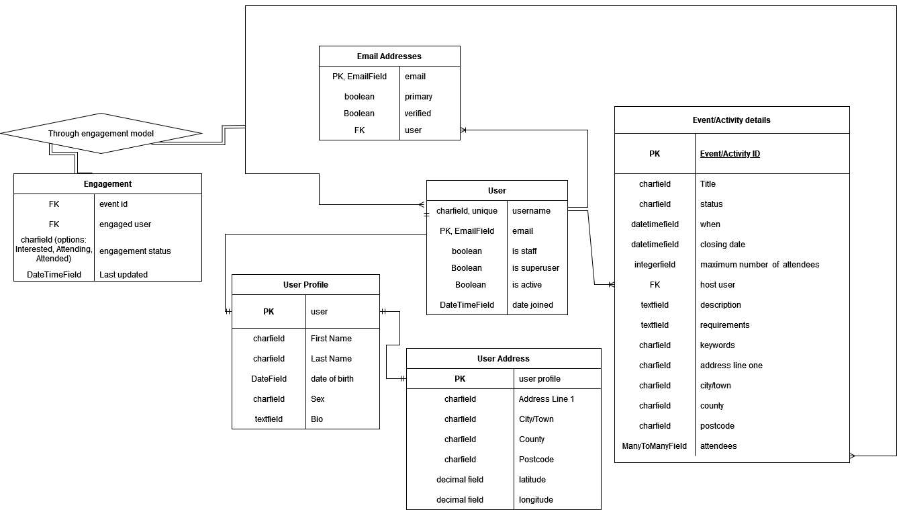
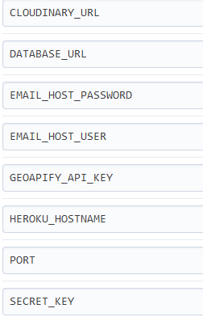

# Eventabase - *Events & Activities Organised by You for You*

## Overview
Eventabase is a UK-based event and activity advertiser and organiser. It allows its registered users to post adverts for group-based events or activities
that they would like to host, so that other users can register their interest to participate in.
A core principle of eventabase is that it is user-driven as indicated by its slogan: Events & Activities Organised by You for You;
the site serves as a medium by which ordinary people can organise and advertise their own activities with people from all across the UK.
It facilitates people in finding something to do in their local area, in making new friends, and trying something new.

The latest version of the site can be viewed [here](https://eventabase.herokuapp.com/).

---

## Current Site Status
The site now essentially exists in its MVP form. There is still many features that are yet to be implemented in order to obtain its full originally intended functionality. As it stands a user can create/edit an account, a profile, as well post new event adverts. They can also search the event adverts posted by other users, and register their interest in those events. They can view the events they are currently interested in, as well as the events they are confirmed to attend; they have the ability to withdraw their interest from an event. Additionally they can view the events they are currently advertising to host, and view the confirmed events they are hosting that are upcoming. The user can also delete their adverts, and cancel their upcoming events. Finally a user as an attendee can obtain the contact details of the event host, whilst the host of an event can obtain the contact details of the attendees --- thus facilitating communication between users.

Much of the more advanced/higher performance functionality and features as originally intended (see [UX Design process](https://github.com/MatthewBayfield/eventabase#ux-design-process)) --- for example search filters, event shortlists, notifications, automated site maintenance, and event calendars --- will be implemented sequentially when possible.

---

## UX Design Process

### Strategy

Often people have the problem of wanting to participate in an activity
or attend an event, but lack other people needed or desired to do an activity,
or attend an event with. Additionally many people are interested in activities
on offer in their local area and beyond, that give them the chance to do
something fun or try something new, both whilst socialising and making new friends;
whether it be looking for a hitting partner in tennis, organising a camping
trip, or going paintballing and so on.

The purpose of the eventabase site is to allow registered users to advertise
group-based events or activities, that other users can register their interest
for participation in. The user organising the event/activity can then select who
to invite, and can communicate further information with those invited to attend.

#### User stories

##### User stories derived from epics derived from themes

<table>
    <thead>
        <tr>
            <th id="themes" scope="col">Themes</th>
            <th id="epics" scope="col">Epics</th>
            <th id="user_stories" scope="col">User stories</th>
        </tr>
    </thead>
    <tbody>
        <!-- account management theme-->
        <!--account creation/deletion epic-->
        <tr>
            <th id="theme1" rowspan="9" headers="themes" scope="row">account management</th>
            <th id=theme1_epic1 headers="epics theme1" scope="row" rowspan="5">account creation/deletion</th>
            <td headers="user_stories theme1_epic1">As a <strong>site user</strong> I can <strong>easily create an account</strong>, so that <strong>I can post or search for events and activities.</strong></td>    
        </tr>
        <tr>
            <td headers="user_stories theme1_epic1">As a <strong>site user</strong> I can <strong>delete my account</strong>, so that <strong>I no longer have one.</strong></td>
        </tr>
        <tr>
            <td headers="user_stories theme1_epic1">As a <strong>site admin</strong> I can <strong>delete accounts that breach T & C</strong>, so that <strong>they can no longer use the site.</strong></td>
        </tr>
        <tr>
            <td headers="user_stories theme1_epic1">As a <strong>site admin</strong> I can <strong>create new admin accounts</strong>, so that <strong>the site can have multiple administrators.</strong></td>
        </tr>
        <tr>
            <td headers="user_stories theme1_epic1">As a <strong>site user</strong> I can <strong>reset my password if I forget it</strong>, so that <strong>I can still use my account .</strong></td>
        </tr>
        <!--create/edit profile epic-->
        <tr>
            <th id=theme1_epic2 headers="epics theme1" scope="row" rowspan="4">create/edit profile</th>
            <td headers="user_stories theme1_epic2">As a <strong>site user</strong> I can <strong>add personal information to my profile</strong>, so that <strong>I don't have to keep re-entering my contact and location details etc. repeatedly.</strong></td>
        </tr>
        <tr>
            <td headers="user_stories theme1_epic2">As a <strong>site user</strong> I can <strong>specify the types of events/activites I like in my profile</strong>, so that <strong>I have a default set of filters when searching.</strong></td>
        </tr>
        <tr>
            <td headers="user_stories theme1_epic2">As a <strong>site admin</strong> I can <strong>alter the keywords/categories the user can select to characterise events/activites they like</strong>, so that <strong> the search filters can be expanded and improved.</strong></td>
        </tr>
        <tr>
            <td headers="user_stories theme1_epic2">As a <strong>site user</strong> I can <strong>specify a "willing to travel distance" in my profile</strong>, so that <strong>I have a default distance filter when searching.</strong></td>
        </tr>
        <!--event/activities theme-->
        <!--post new events/activities epic-->
        <tr>
            <th id="theme2" rowspan="11" headers="themes" scope="row">Event/activities management</th>
            <th id=theme2_epic1 headers="epics theme2" scope="row" rowspan="6">post new events/activities</th>
            <td headers="user_stories theme2_epic1">As a <strong>site user</strong> I can <strong>advertise an event/activity</strong>, so that <strong>other users can register
            their interest.</strong></td>    
        </tr>
        <tr>
            <td headers="user_stories theme2_epic1">As a <strong>site user</strong> I can <strong>provide an event/activity description</strong>, so that <strong>
            other users know what the event/activity involves.</strong></td>
        </tr>
        <tr>
            <td headers="user_stories theme2_epic1">As a <strong>site user</strong> I can <strong>specify the number range of people that can attend the event/activity</strong>, so that <strong>
            other users know how many people can attend.</strong></td>
        </tr>
        <tr>
            <td headers="user_stories theme2_epic1">As a <strong>site user</strong> I can <strong>specify a date range for the occurence of the activity/event </strong>, so that <strong>
            other users know whether they are able to attend.</strong></td>
        </tr>
        <tr>
            <td headers="user_stories theme2_epic1">As a <strong>site user</strong> I can <strong>specify a 'closing date'</strong>, so that <strong>
            I have time to decide who to invite for the event/activity.</strong></td>
        </tr>
        <tr>
            <td headers="user_stories theme2_epic1">As a <strong>site user</strong> I can <strong>cancel my advertsied event/activity</strong>, so that <strong>I can cancel it, for example if not enough people are attending.</strong></td>
        </tr>
        <!--search events/activities epic-->
        <tr>
        <th id=theme2_epic2 headers="epics theme2" scope="row" rowspan="5">search events/activities</th>
            <td headers="user_stories theme2_epic2">As a <strong>site user</strong> I can <strong>search for activities/events using optional, default, and no filters</strong>, so that <strong>I can find events/activites that are suitable and desirable.</strong></td>
        </tr>
        <tr>
            <td headers="user_stories theme2_epic2">As a <strong>site admin</strong> I can <strong>automatically remove expired events/activities from the search results</strong>, so that <strong>I don't have to manually update them.</strong></td>
        </tr>
        <tr>
            <td headers="user_stories theme2_epic2">As a <strong>site admin</strong> I can <strong>remove a specific event/activity from the search results</strong>, so that <strong>invalid events/activites can be removed.</strong></td>
        </tr>
        <tr>
            <td headers="user_stories theme2_epic2">As a <strong>site user</strong> I can <strong>click on an event/activity in the search results</strong>, so that <strong> I can view more information about it.</strong></td>    
        </tr>
        <tr>
            <td headers="user_stories theme2_epic2">As a <strong>site user</strong> I can <strong>add available activities/events to a shortlist</strong>, so that <strong> I can look at them again later.</strong></td>    
        </tr>
        <!--user interaction and feedback theme-->
        <!--user selection epic-->
        <tr>
            <th id="theme3" rowspan="13" headers="themes" scope="row">User Interaction and feedback</th>
            <th id=theme3_epic1 headers="epics theme3" scope="row" rowspan="4">user selection</th>
            <td headers="user_stories theme3_epic1">As a <strong>site user</strong> I can <strong>for my event/activity select who to invite out of those interested, by viewing their profiles and other metrics</strong>, so that <strong>I can choose the people I prefer.</strong></td>
        </tr>
        <tr>
            <td headers="user_stories theme3_epic1">As a <strong>site user</strong> I can <strong>register my interest in an event/activity</strong>, so that <strong>I have a chance to be invited by the host.</strong></td>
        </tr>
        <tr>
            <td headers="user_stories theme3_epic1">As a <strong>site user</strong> I can <strong>unregister my interest in an event/activity</strong>, so that <strong>I can change my mind.</strong></td>
        </tr>
        <tr>
            <td headers="user_stories theme3_epic1">As a <strong>site user</strong> I can <strong>have a prefered users list</strong>, so that <strong>I can notify them directly of an event/activity I am hosting.</strong></td>
        </tr>
        <!--notifications epic-->
        <tr>
            <th id=theme3_epic2 headers="epics theme3" scope="row" rowspan="6">notifications</th>
            <td headers="user_stories theme3_epic2">As a <strong>site user</strong> I can <strong>receive notifications when new activities/events I like are posted</strong>, so that <strong>I am informed about events/activities that may be of interest.</strong></td>    
        </tr>
        <tr>
            <td headers="user_stories theme3_epic2">As a <strong>site user</strong> I can <strong>receive notifications when users register their interest in my advertised events/activites</strong>, so that <strong>I can keep track of the level of interest and I know when enough people have registered for the activity/event.</strong></td>    
        </tr>
        <tr>
            <td headers="user_stories theme3_epic2">As a <strong>site user</strong> I can <strong>receive notifications when I am invited to an event/activity</strong>, so that <strong>I know I can attend.</strong></td>    
        </tr>
        <tr>
            <td headers="user_stories theme3_epic2">As a <strong>site user</strong> I can <strong>receive notifications about events/activites I have been invited to attend</strong>, so that <strong>I am aware of any important information.</strong></td>    
        </tr>
        <tr>
            <td headers="user_stories theme3_epic2">As a <strong>site user</strong> I can <strong>view a calender of my upcoming events and activities</strong>, so that <strong> I am aware of my schedule.</strong></td>    
        </tr>
        <tr>
            <td headers="user_stories theme3_epic2">As a <strong>site user</strong> I can <strong>receive notifications about an upcoming event/activity I am attending</strong>, so that <strong>I don't forget to attend.</strong></td>    
        </tr>
        <!--review/ratings epic-->
        <tr>
            <th id=theme3_epic3 headers="epics theme3" scope="row" rowspan="3">review/ratings</th>
            <td headers="user_stories theme3_epic3">As a <strong>site user</strong> I can <strong>review events/activites and other users</strong>, so that <strong>users have metrics to indicate the quality of their hosting or participation.</strong></td>    
        </tr>
        <tr>
            <td headers="user_stories theme3_epic3">As a <strong>site user</strong> I can <strong>report issues with events/activities or other users</strong>, so that <strong>they can be resolved by a site administrator.</strong></td>    
        </tr>
        <tr>
            <td headers="user_stories theme3_epic3">As a <strong>site admin</strong> I can <strong>remove malicious or suspicious reviews </strong>, so that <strong>any user's rating is accurate.</strong></td>    
        </tr>
    </tbody>
</table>

##### Other user stories

- As a **first time site user** I can **understand the purpose of the site and how it works from viewing the landing page**, so that **I can decide whether to create an account**.

### Scope

#### Requirements
Considering the strategic goals and user needs of the site as expressed in the previous section, the following table dictates a core set of requirements --- each assigned with an importance rating --- for the eventabase site. Time constraints along with the relative importance and feasibility of requirements will determine which requirements are prioritised, and thus fulfilled in the minimal viable product.
<table>
    <thead>
        <tr>
            <th id="requirement_type" scope="col">Requirement type</th>
            <th id="requirement" scope="col">Requirements (importance 1-5)</th>
        </tr>
    </thead>
    <tbody>
         <!--objective requirements-->
        <tr>
            <td headers="requirement type">Objective</td>
            <td>
                <ul>
                    <li>A site user needs to be able to register an account on the landing page, or sign in if already registered. <strong>(5)</strong></li>
                    <li>A registered user needs to be able to advertise events and activities, in order to find other people to participate in them with. <strong>(5)</strong></li>
                    <li>A registered user needs to be able to discover events/activities to do with other people in their selected area. <strong>(5)</strong></li>
                    <li>A registered user needs to be able to communicate with other users information about hosting/attending an activity/event. <strong>(5)</strong></li>
                    <li>Site administrators need administrator accounts to perform administrative duties. <strong>(3)</strong></li>
                </ul>
            </td>
        </tr>
        <!--content requirements-->
        <tr>
            <td headers="requirement type">Content</td>
            <td>
                <ul>
                    <li>The site must present entries from a searchable backend database of user-hosted advertised events and activities. <strong>(5)</strong></li>
                    <li>Expired events/activities are removed from the displayed database entries automatically, either when their closing date has past or when they are cancelled. <strong>(5)</strong></li>
                    <li>Registered users must have an editable profile with information including their personal details, their location, the events/activity types they prefer, specified using either provided or possibly custom keywords; and the distance they are willing to travel. These details will define the default search filters. <strong>(4)</strong></li>
                    <li>A user in their profile should have an optional 'bio' section to describe a bit about themselves. <strong>(1)</strong></li>
                    <li>The site must contain viewable 'Terms and Conditions. <strong>(3)</strong></li>
                    <li>Advertised events/activites must have an event description, and a set of summary keywords to act as filters. In addition they must specify
                    their location, a date or date range for their occurence, and a date to register interest by. <strong>(5)</strong></li>
                    <li>Events/activities, users, and reviews should have a displayed unique identifier primarily for admin purposes. <strong>(3)</strong></li>                    <li>Advertised events/activites need to have the option of having a user uploaded image. <strong>(2)</strong></li>
                    <li>The site must contain observable ratings/reviews of other users indicating their quality as a host or participant. <strong>(4)</strong></li>
                    <li>A viewable, potentially interactive, calendar of upcoming events/activities for a user exits. <strong>(3)</strong></li>
                </ul>
            </td>
        </tr>
        <!--functional requirements-->
        <tr>
            <td headers="requirement type">Functional</td>
            <td>
                <ul>
                    <li>Users that are not registered or not signed in should only be able to view a landing page. <strong>(5)</strong></li>
                    <li>A user must be able to sign up for an account using a unique username, password, and email; the email should be verified. <strong>(5)</strong></li>
                    <li> A user must be able to delete their account. <strong>(1)</strong> </li>
                    <li>A user must be able to reset their password when trying to sign in. They must also have the option of changing their password, username and email when
                    signed in. <strong>(2)</strong></li>
                    <li>A user when searching for events/activities must be able to have the option of using togglable default filters based on their profile, as well as optional filters that categorise the events/activities of the database. <strong>(4)</strong></li>
                    <li>A user must be able to view more information about a displayed event/activity in the search query results. The initial information dislayed should be
                    the title, location, date, closing date, distance away, summary keywords. <strong>(4)</strong></li>
                    <li>A user must be able to register their interest in an advertised event/activity. <strong>(5)</strong></li>
                    <li>A user needs to be able to view a list of events/activites they have registered their interest in, and be able to remove an event/activity from this list. <strong>(4)</strong></li>
                    <li>A user must be able to create a shortlist of events/activities they can view later, before registering their interest. <strong>(2)</strong></li>
                    <li>A user must be able to provide a review and rating out of 5 for a user as a participant, or a user as a host. <strong>(4)</strong></li>
                    <li>A host user of an event/activity must be able to cancel their event or activity. <strong>(5)</strong></li>
                    <li>A host user of an event/activity must be able to select which users to invite, out of those interested in attending their event or activity. <strong>(5)</strong></li>
                    <li>The host should be able to rank users by their participant rating, as well as view the profiles of other users. <strong>(3)</strong></li>
                    <li>A user needs a way of reporting issues with another user, a review, or an issue with their account. <strong>(3)</strong></li>
                    <li>A user has a favourite user list or friends list, and a way of adding, removing users to this list. <strong>(1)</strong></li>
                    <li>A user should receive notifications both on the site and or by email: when new events/activites of interest to them are posted; when a user registers their interest in their activity/event; or a reminder to attend an upcoming event/activity. <strong>(3)</strong></li>
                    <li>A user needs a message dashboard to communicate with other users when invited to an attend an event/activity. <strong>(4)</strong></li>
                    <li>Site admins need to be able to create other administrator accounts. <strong>(2)</strong></li>
                    <li>Site admins need to be able to view and delete accounts, remove malicious user reviews, edit database search filters,
                    remove invalid events and acitivities. <strong>(3)</strong></li>
                    <li>Site admins need to be able to have a message dashboard to receive reported user issues, and to interact with users. <strong>(3)</strong></li>
                </ul>
            </td>
        </tr>
    </tbody>
</table>

### Structure

#### Information design
Access to content, and the available functionality on the site will be determined based on the type of user. Users can be split into signed-in users --- which further can be split into registered user accounts and site administrator accounts --- and users not signed-in with a user account. User accounts will require passwords which will be stored in hashed form using django's default hashing algorithm; the non-admin accounts will also require email verification.

The site will potentially consist of the following pages:

Accessible to all users:
- a generic landing/home page - will act as the first point of contact, and explain the purpose of the site as well as how to use the site. It will need to be attractive
and fairly minimal. Must contain clearly visible sign-up and sign-in options for the user to interact with.
- a sign-up/registration page - must enable validated form input for the user's name, username, email, and password. Upon registering and verifying their account email, the
user should be taken to their home page.
- a T & C page containing the terms and conditions of the site.

Accessible to registered users only:
- a registered user home page - Once registered users have signed in, they should be taken to their home page. This page will contain navigation and button elements that allow the user to view other relevant pages or modals/panels, and thus perform all of the desired functionality on the site. The page should be divided into a profile section; a search/host events and activities section. The latter section will have distinct subsections, including a section for reviewing/rating other users and activities/events.
- search and retrieve events/activities page - This page will display a list of events/activities retrieved from the database, filtered using available filters. Each item in the list will be able to be expanded to view more information about the item.
- registered user message/notifications dashboard page - will feature messages from admins and other users, as well as notifications about new events/activities or when someone registers their interest in an activity/event hosted by the user. Should allow communication between admins and users.

Accessible to site admins only:
- an administrator home page - This page will host all of the functionality necessary to perform administrative duties, such as editing the T & C, viewing user accounts and
events/activities etc.
- admin message dashboard - will feature messages/reports from users. Should allow communication between admins and users.

Accessible to site admins and registered users:
- an account settings page - where a user can change their account email, password, and username; as well as delete their account.

#### Interaction design

A navigation bar common to all registered-user-accessible pages and admin-accessible pages other than the T & C page, will feature a home button link, a sign-out link, a message/notifications indicator/link and a 'more' hamburger icon menu; the hamburger menu featuring an account settings and T & C link. The all-user-accessible landing page will feature a nav bar with only a sign-in/sign-up link, and a T & C link within a hamburger icon menu. The T & C page nav bar will feature a sign-out/sign-in/sign-up link and a home button link.

Modals opened on one of the pages or expandable side panels, will be used frequently to allow functionality such as posting new events/activities, viewing more information about an event/activity etc. These modals or side panels will be opened when labelled buttons, links, or icons are clicked by the user. They will take up most of the page, and will be closable both automatically and manually by the user. 

Most pages will feature content that can be expanded and collapsed, thus decluttering the page while keeping all functionality and content available when needed.

For the pages/modals/panels requiring extended user input --- such as the user profile, or when writing a review --- validated form fields will be used.

Depending on the user sign-in status, the type of user, as well as other state factors, the available buttons and other interactive elements displayed will vary, and change
dynamically. For example if a user has registered their interest in an event/activity using the 'register interest button', the button will change to allow the user the functionality of unregistering interest.

#### Planned site structure/connectivity diagrams

The first diagram below shows the possible page, modal, and panel connectivity not using the navigation bar; it assumes all requirements/user stories are fulfilled. The 2nd diagram shows the connectivity between pages using only the navigation bars.

### Skeleton

#### Wireframes
Below are links to the mobile wireframes of each page, as well as for the modals; there are no separate desktop wireframes, as the intention is to keep the appearance of
the site as a whole the same across all devices, using only a responsive design as opposed to an adaptive design; this will be achieved in part by allowing vertical scrolling on all pages, modals, and panels where needed.

##### Pages
[Landing page](docs/wireframes/wireframe_landing_page.png)

[User registration page](docs/wireframes/wireframe_registration_page.png)

[Home page for registered users](docs/wireframes/wireframe_home_registered_users.png)

[Home page for admin users](docs/wireframes/wireframe_home_admin_users.png)

[Account settings page](docs/wireframes/wireframe_account_settings.png)

[Terms and conditions page](docs/wireframes/wireframe_terms_conditions.png)

[Search and retrieve events and activities page](docs/wireframes/wireframe_search_events_activities_page.png)

[Notifications/Messages dashboard page](docs/wireframes/wireframe_notifications_messages_page.png)

##### Modals

[Sign-in Modal](docs/wireframes/wireframe_sign_in_modal.png)

[Reset password Modal](docs/wireframes/wireframe_rest_password_modal.png)

[Edit profile Modal](docs/wireframes/wireframe_edit_profile_modal.png)

[Post new event/activity Modal](docs/wireframes/wireframe_post_new_event_activity_modal.png)

[Review user event/activity/user Modal](docs/wireframes/wireframe_review_user_event_activity.png)

[View more information for event/activity Modal](docs/wireframes/wireframe_more_info_event_or_activity.png)

[View interested or invited Modal](docs/wireframes/wireframe_view_interested_or_invited.png)

[View event/activity shortlist Modal](docs/wireframes/wireframe_activities_or_events_shortlist.png)

[Event/Activity calendar Modal](docs/wireframes/wireframe_calendar_modal.png)

[View interested users Modal](docs/wireframes/wireframe_view_interested_users.png)

[Message host/attendees/user Modal](docs/wireframes/wireframe_message_host_or_attendees_or_user.png)

[View user's profile/reviews Modal](docs/wireframes/wireframe_view_user_profiles_reviews_modal.png)

[View own reviews Modal](docs/wireframes/wireframe_own_reviews.png)

[Report issue Modal](docs/wireframes/wireframe_report_issue.png)

[Review user/event/activity Modal](docs/wireframes/wireframe_review_user_event_activity.png)

[Create admin account Modal](docs/wireframes/wireframe_create_admin_account_modal.png)

[Edit T & C Modal](docs/wireframes/wireframe_edit_t_and_c_modal.png)

[Alter keywords Modal](docs/wireframes/wireframe_alter_keywords_modal.png)

[View user's reviews Modal](docs/wireframes/wireframe_users_reviews_modal.png)

[View reviews of user Modal](docs/wireframes/wireframe_view_reviews_of_user_modal.png)

[View user's events/activities Modal](docs/wireframes/wireframe_view_users_events_or_activities.png)

[View user's profile Modal](docs/wireframes/wireframe_view_user_profile_modal.png)

[View review or event/activity Modal](docs/wireframes/wireframe_view_review_or_event_modal.png)

### Surface

'Hover for more info' icons will be used to guide the user in understanding how to use parts of the site, as well as when providing user input or interpreting displayed information. Regular feedback and helper prompts will also be provided to the user where necessary in order to maximise user experience and minimise user effort. 

Icons and other visual aids will also be used where possible to further make using the site simple and more enjoyable; for example a new message/notification counter will
be visible just above the message dashboard icon link in the nav bar. An attempt will be made to dynamically focus the user's attention where it needs to be, throughout performing a specific task; for example changes to background or font colours as well as the use of highlighting/dimming will be used where suitable.

Compulsory form/input fields will be indicated, and missing or invalid inputs will be highlighted to users, with a clarifying explanation message.

Images will be used on the landing page, as well on advertised events/activities where the user uploads an image. An uploaded profile image may also be available
to the user. Likewise some animation/transitions will feature on the landing page, through a slide show of background header images, and a cycling of messages in a bar
below the header, that motivate use of the site, and indicate its purpose to the user.

Finally, in regard to the potential typography and colour schemes employed, the aim will be to maximise the readability and also attractiveness of the site content, by creating 
a clear pattern of use that helps to distinguish content and highlight the most important content. The final choices will be decided through experimentation and manual user feedback, as well as by which fonts and color scheme combinations sufficiently satisfy accessibility requirements.

---

## Current site
The current site can be viewed [here](https://eventabase.herokuapp.com/).

### Existing Features

#### Overview
As has been mentioned previously much of the original design is yet to be implemented, and so not all planned features are complete or present, but will be introduced
as the site development continues. Additionally some of the original design will not be implemented as planned either because it is no longer needed, or because
an improvement to the design has been made. For example the image slideshow as it is implemented is quite different to its initial wireframe, and this is seen as an improvement.

#### General features
All clickable objects, mainly buttons, indicate clicked feedback through a color change. All buttons are also can be accessed using the tab key, and clicked using the enter key, with feedback again given. All focusable elements clearly indicate when they are focused. Screenshots below show examples of clicked feedback.

  

#### Authentication/Security features
The site, with the assistance of the django-allauth integrated applications, prevents unauthenticated users from viewing or modifying any content on the site only intended for
authenticated users. If an unauthenticated user attempts to access a prohibited page, they are redirected to the sign-in or landing page. In order to create a new account a user is required to verify their supplied email, before being able to sign-in to their new account. Using Django's in-built CSRF protection, all post requests, for example during form submission, require a CSRF token.

#### Navigation bar

The above screenshots show the navigation bar and the expanded more menu, that are common to all pages. The exact navigation buttons vary depending on the authentication status
of the user. For an authenticated user, the home button takes the user to the generic landing page; whilst an authenticated user will be taken to their specific homepage. The
sign-up and sign-in buttons allow a user to sign-up or sign-in to an account. Once a user has logged in the sign-in button changes to a sign-out button.

Also on the navigation bar is the more button, that when clicked triggers the opening of a closable more menu. It features further links to other site pages. At the moment the only link present is the terms and conditions link, allowing a user to view the site terms and policies. The menu is closable by either clicking the close button or by
clicking anywhere outside the menu. The navigation bar remains fixed to the top of the viewport with scrolling, enabling easy access at all times.

#### Footer

The footer like the navigation bar is common to all pages, and features a 'site navigation' and 'contact us' section. The site navigation section currently contains a back to top button, whilst the 'contact us' section displays the email address for users to use to contact the site administrators.

#### Landing page features/content

##### Header

A header containing the site name and slogan are clearly displayed in the header of the page, indicating to the user the purpose of the site.

##### Image automated slideshow

Between the header and the navigation bar, is an automated image slideshow, that changes roughly every 8s. The images show people participating in an eclectic range of events and
activities, thus illustrating to the user the types of events and activities they could advertise or attend using the site. It also helps entice the user to sign-up.

##### How it works section
In the main body of the landing page is a 'How it works' section, explaining to the user how the site functions, and motivating its use.

##### Next steps section
Also in the main body of the landing page, below the 'How it works' section, is the 'next steps' section. This is intended to concisely inform the user of how to create an account and get started posting new, or searching for event adverts. As part of this section, adjacent to the list of next steps, are two unmissable sign-up and sign-in buttons,
making it easy for a user to do either action.

#### Sign-Up page features/content

##### Header
A clearly visible title in the header informs the user they are on the account registration page.

##### Sign-Up Form
Just before the sign-up form the user is prompted to sign-in if they already have an account, and can access the sign-in page via the provided link. In the form itself, the user is prompted to enter an email, username and password, with both the email and password fields requiring to be entered twice. The required fields are indicated visually with an asterisk. All fields also have placeholder values.

For the fields that need to be entered twice, a matching indicator is present on the second field, indicating in real time whether the two field values match or not. Additionally for the username and password fields, there exists help icons, that when touched or hovered over, display help text for completing that field.

All form fields are validated, and after a failed attempted form submission, the problem fields are indicated, and error feedback is provided. At the bottom of the form is the sign-up form submission button.

#### Sign-In page features/content
##### Header
A clearly visible title in the header informs the user they are on the sign-in page.

##### Sign-In Form
Just before the sign-in form the user is prompted to sign-up if they do not already have an account, and can access the sign-up page via the provided link. In the form itself, the user is prompted to enter their account email and password. Again the required fields are indicated, and have placeholder values. After a failed form submission, the user is informed that the email and or password are incorrect.

Below the fields there is a 'remember me' checkbox, allowing a user to remain logged-in when accessing the site from the same browser and device. There is also a forgot password link, allowing a user to reset their password if needed. Finally there is a link to the adminstrator login page for site administrators.

Also below the form fields is the form submission button.

#### Registered user Home page features/content

##### Edit profile modal form
When a new user signs in to their new account for the first time, the edit profile form modal is automatically opened, and can not be closed until the new user completes the form
in order to create their mandatory user profile. The modal like all other modals on the site displays on top of the content behind, occupying most of the page, and can be scrolled independently. It is impossible to interact with the content outside of the modal, as well as tab out of the modal. The modal contains the edit profile form, above which on first login a message displays, instructing the user to complete the form.

As with all forms on the site, the required form fields are indicated with an asterisk, and there are again help text icons providing help text for completing some fields.
The form can be split into personal info and address fields. All fields are validated, with problem fields being indicated, along with error feedback given, if an invalid form is
submitted. The form is submitted using the done button at the bottom of the form.

The same modal is also used to edit an existing user profile. In this context the edit profile form is prefilled with a user's current profile field values. In addition the modal
can now be closed either by clicking the close button at the top, or the cancel button at the bottom of the modal. Closing the modal also triggers a form refresh, so that if any of the field values were altered in the modal form, they are restored, so that opening the modal again still shows the user's current profile field values.

Screenshots of the modal on first login of a new user:

Screenshots of the modal when opened to edit an existing profile:

##### Header
A clearly visible header contains the message welcome back followed by the user's username, indicating the user has signed in and viewing their home page.

##### Expand More/Less Icons
Every section of the homepage can be expanded and contracted to reveal the whole section content or just the section heading. This is achieved using
expand less and expand more icons at the bottom of each section.

Screenshot showing the unexpanded sections, with the expand-more icons visible.

##### User Profile section
The main body of the homepage currently consists of three sections (eventually 4): the user profile section, the search and view events section, and the post events section. 

The user profile section displays the user's user profile information. It also contains the edit profile button, that when clicked opens
the edit profile modal form, allowing the user to edit their profile. When an edit profile modal form is successfully submitted, the profile section
is dynamically updated in real time without the need to refresh the page.

##### Search and View Events section
This homepage section allows a user to view the events for which they have registered their interest, as well as events that they have upcoming as a confirmed attendee. Which of these types of event are displayed is controlled by clicking one of the event type radio inputs. When viewing a user's interested events, the user has the ability to withdraw their interest using the withdraw interest button. Likewise when viewing a user's upcoming events they can withdraw from an event, as well view the contact details of the host
of the event using the corresponding buttons. The number of attendees for an event is also displayed to the user.

Also in this section is the search adverts button that will take the user to the search event adverts page, where they can view all the current event adverts.

##### Host Event section
The host events section displays the user's current event adverts, as well as the details of upcoming events that the user is confirmed to host.
The user can toggle between viewing each set of events using the event type radio inputs. Each event advert can be deleted using the 'delete advert' button,
whilst the upcoming events can be cancelled using the cancel buttons for each event. The upcoming events also have an attendee info button, that when clicked retrieves
the contact details of the attendees of the event, displayed in a contact info modal.

Upcoming events whose occurrence dates have passed are automatically, after refresh, deleted and no longer displayed. Similarly event adverts whose closing dates have passed, are automatically, after refresh, moved into the user's upcoming events. 

The section also contains the post event button, that when clicked opens the post events modal form, and thus allows the user to post new event adverts that
they wish to host.

##### Post events modal form
The post events modal form allows users to post new event adverts. Like all modal forms on the site all form fields are validated, and there
are help icons for certain fields. The various fields allow a user to specify what the event or activity involves, when and where it will occur,
any requirements, the number of people that can attend, and finally when the advert closes. The modal can be closed in an identical manner to the
edit profile modal, with the form being refreshed again. The user can submit the form using the done button at the bottom of the modal.
Successful form submissions result in the event advert being added to the user's viewable advertised events, without refresh. A user is prevented from posting an advert for an event whose date of occurrence clashes with an event they are attending or are interested in.

##### Contact info modals
As referenced in the host events and view events sections, a user can view the contact details of either the attendees of an event they are hosting, or the contact details of the
host of an event they are attending, using the respective buttons. The contact details are displayed in a table within a modal, which can be closed by the user. Screenshots
of the two possible types of contact info modals are displayed below:

##### Dynamic page updates
Through the use of fetch requests, updates to the homepage content, necessary after a user action is performed, are performed without the need to refresh the page, thus improving the user experience. 

##### Alerts, feedback, and email notifications
Every time a user successfully completes an action --- for example posting a new event advert, updating their profile, withdrawing from an event --- feedback is provided to the user in the form of a success response modal; additionally an error/information response modal is displayed when an action is unsuccessful, notifying a user
of this, and possibly why the action was unsuccessful. Finally email notifications are sent to the host of an event when a confirmed attendee withdraws, as well as to the confirmed/interested attendees of an event, when that event/advert is cancelled/deleted by the host.

Some examples of the response modals to user actions are visible in the screenshots below:

#### Search Adverts page features/content

##### Header
A clearly visible header indicates to the user the purpose of the page.

##### Current Adverts section
All currently available event adverts are displayed to a user in this section. Adverts for events whose occurrence dates clash with a user's other events they are hosting or potentially attending, are filtered out. Likewise expired adverts, or adverts for which the maximum number of attendees are now attending, are filtered out. Additionally if an event advert is deleted, or the number of attendees changes after the advert has been loaded, then the user is still prevented from registering their interest, if they attempt to do so. A user registers their interest in an event using the register interest button for the relevant event advert.

##### Alerts and Feedback
Similarly as was the case for a user's homepage, user actions both unsuccessful and successful are followed by a feedback response modal --- including for actions such as registering interest in an event.

Some examples of the response modals to user actions are visible in the screenshots below:

#### Terms and conditions page features/content

##### Header
A clearly visible title in the header informs the user they are on the terms and policies page.

#### Administrator page
A very basic administrator page exists, where a site administrator can view/delete/edit/add registered users, user profiles, user email addresses, and events and activities. They can also create further administrator accounts, and verify email addresses.

In its current form, an administrator should be careful when deleting/creating model instances of some of the aforementioned user and event objects. For example if an
administrator deletes/adds a user address, they must also delete/add a user profile to prevent database errors. Eventually Django signals will be used to ensure
related models not automatically updated, are so.

---

### Current Data model
The existing data model includes only a fraction of the models/tables and relationships planned for the finished site. Namely there are currently only database tables for
users, user profiles, user addresses, user email addresses, and event/activity details. Future tables for user reviews will be added, as well as relationships such as a many-to-many relationship via a custom through-table between the user table and event table, in order to track user engagement with an event.

The current database scheme can be seen in the following screenshot:

### Testing
Testing documentation can be found in [TESTING.md](TESTING.md).

---

## Deployment

The eventabse was deployed on [heroku](https://www.heroku.com/).

The live URL link is: [https://eventabase.herokuapp.com/](https://eventabase.herokuapp.com/)

It was deployed using the following procedure:

1. Log in to your Heroku account, or create an account if required.
2. At the top right of the Heroku dashboard click the "New" button, and from the menu that appears, click the 
'Create new app' button.
3. In the 'Create New App' section that follows, enter a unique name for the app, (indicated by a green tick) in the App name field, and also
select a region, using the 'choose a region drop-down list.
4. Once you have entered a unique app name and selected your region, click the 'create app'
 button.
5. After clicking 'create app' you are then taken to the deploy tab on your apps homepage. From here click on the
'Settings' tab button to view the app settings.
6. On the settings tab scroll down to the 'Config Vars' section, and click the 'Config Vars' button to reveal the configuration
variables for the app.
7. In the opened subsection, enter values for the following keys in the screenshot below. They include the URL's of the eventabase database, as well as the static file server. Also featured is the Django secret key, Geoapify API key (for geolocation) as well as the eventabase host email settings.

8. Having entered the config vars, next scroll back up to the top of the page, and the click back on the 'Deploy' tab button.
9. On this tab, scroll down to the 'Deployment method' section. In this section select 'Github' as
the deployment method.
10. Subsequently log in to your Github account as requested, and select to deploy the main branch of the eventabase repository.
11. Finally enable automatic deploys, before clicking to deploy the branch.

## Technologies used
- python
- Javascript
- HTML
- CSS
- Django framework

## Credits

### Main libraries, frameworks and API's
- Django
- django-allauth - for user authentication.
- Jest - for JS tests.
- Cloudinary - to serve all static files.
- Coverage - to measure python test coverage.
- dj-database-url - to obtain the database url
- dj3-cloudinary - to aid uploading static files to cloudinary during development.
- Geoapify API - for obtaining latitudes and longitudes for addresses.
- ElepantSQL - to host the database

### Content 
 - All slideshow images were downloaded from pexels.com
 - fonts were obtained from google fonts
 - Icons from font awesome and google icons.
 - The flowchart and diagram generating site [https://app.diagrams.net/](https://app.diagrams.net/) was used to produce the diagrams in my README.
