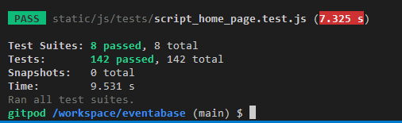
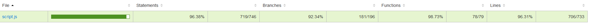
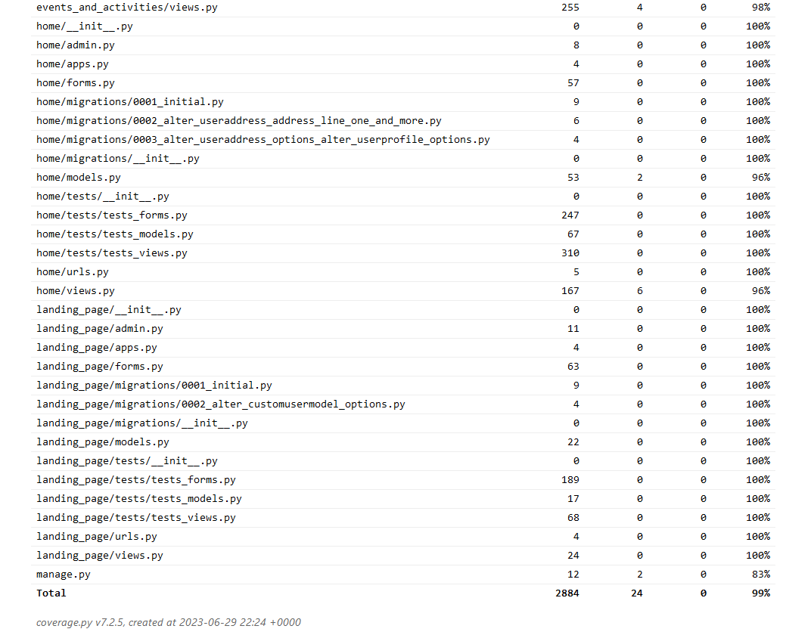
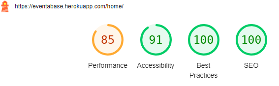

# Testing

## Overview
The vast majority of formal testing was performed using automated testing methods, through the use of Jest for the JS code, and the use of Django testing tools/classes (which are extensions of unittest) for the python code. The responsiveness and styling of the site were assessed through informal manual testing using the browser Devtools. Additionally some informal testing of the python and JS code was undertaken by inspecting the site in the browser and performing various tasks to check whether the results were consistent with that of the corresponding automated tests.

To test the performance and accessibility of the site various browser extension tools were employed.

Finally HTML, CSS, python and JS validators/linters were used to assess code validity.

## Jest testing of JS code
The raw JS testing scripts and accompanying HTML content for the tests can be found in the [static/js/tests](static/js/tests) repository directory.
As it stands all created jest test suites and their constituent tests are passing.

With regard to code coverage the percentage of code tested is indicated in the following screenshot:

As it can be seen from the screenshot 100% of functions have been tested, 98% + of all statements, and 91% + of all branches. The uncovered branches correspond to a few implicit, but irrelevant else branches, and two uncovered if branches within the same function, which will shortly be tested.

## Python testing using Django testing tools and classes
The python test scripts can be found in the tests folder of each eventabase app, as can be found in the repository.
As it stands all tests are passing.

With regard to coverage 99% of all code has been tested. In reality more code than this has been tested, as this includes the
eventabase settings file and the django manage.py file. The screenshots below show the coverage breakdown:

## Lighthouse tool
Landing page scores:

mobile:

desktop:

sign-in page scores:

mobile:

desktop:

sign-up page scores:

mobile:

desktop:

homepage scores

mobile:

desktop:

## Validators and Linters

### HTML validator
All HTML code passes the W3C HTML validator, except for a few input elements that share the same id values. This is a consequence of Django's model form
rendering, and the fact that the same fields feature in two different forms on the homepage. To be more specific the ids generated for the
input elements are generated from the field name automatically, and so if two fields of different forms share a field name, then they will
also share the same id. This happens for the address fields. This will need to be rectified by manually setting the input element ids.

### CSS validator
All CSS code passes the W3C CSS validator except for a depreciated media feature warning for 'max-device-aspect-ratio' used in a media query.
This will need to be removed, and the media query rewritten without it.

### Jshint linter
All JS code passes the jshint linter without any significant issues.

### Python linters flake8 and pylint
No significant issues were found using the flake8 and pylint linters. The only issues raised were line too long warnings.

## Accessibility
The ARC toolkit tool revealed no significant issues other than that related to the duplicated input ids as mentioned before. The NVIDA screen reader
was used as well to test the accessibility of the site. The site achieved a 'AAA' rating when using the WCAG contrast checker.

[return to README.md](README.md#Testing)
